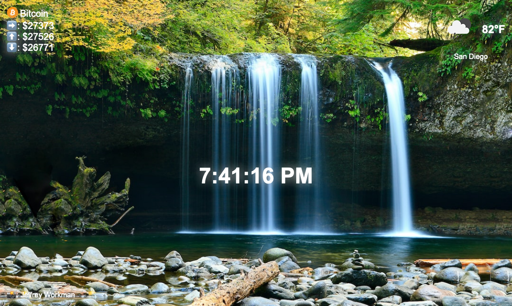

# personal dashboard

This is my version of the capstone project for Module 9 of [Scrimba.com's Frontend Career Path](https://scrimba.com/learn/frontend/).

## Contents 

- [Overview](#overview)
  - [Built with](#built-with)
- [Screenshot](#screenshots)
  - [Desktop](#desktop)
  - [Mobile](#mobile)
- [Status](#status)
- [Connect](#connect)

## Overivew

This is a personal dashboard which can be set as a Chrome extension to be displayed whenever you open a new tab. The dashboard displays Bitcoin prices (current, 24hr high, 24hr low), weather information, the current time, and a nature background pulled from Unspalsh.

### Built with

- HTML
- CSS 
- JavaScript
- REST API

## Screenshot

## Status

A live version can be viewed at: 

## Connect

Thank you for reading about this project. If you'd like to connect with me for mentoring, collaboration, or employment opportunities, you can do so via the following links:

- [Email](https://anthonynanfito.com/contact/)
- [LinkedIn](https://linkedin.com/in/anthonynanfito)
- [Portfolio](https://ananfito.github.io)
- [Blog](https://ananfito.hashnode.dev)

